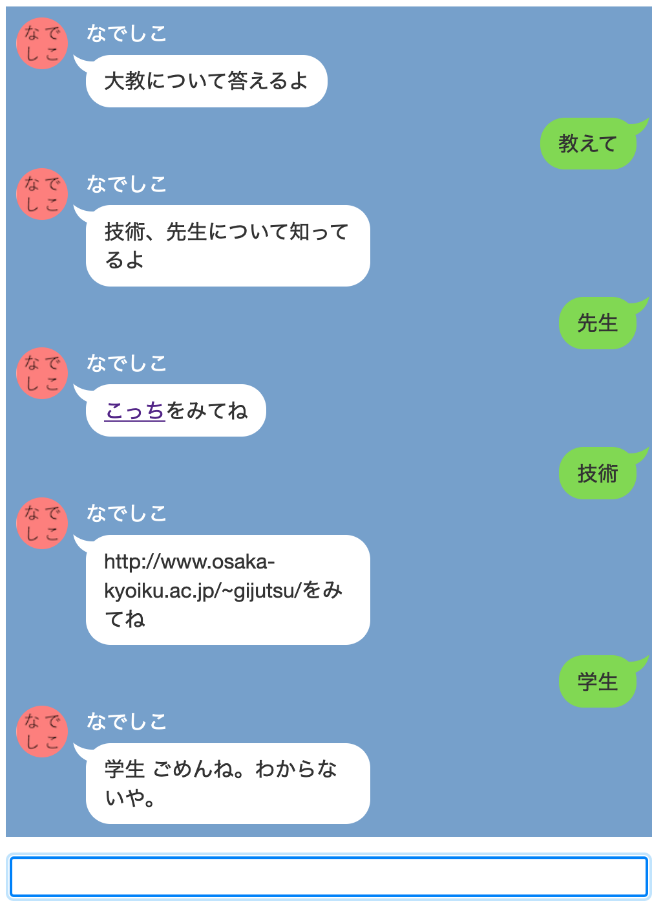
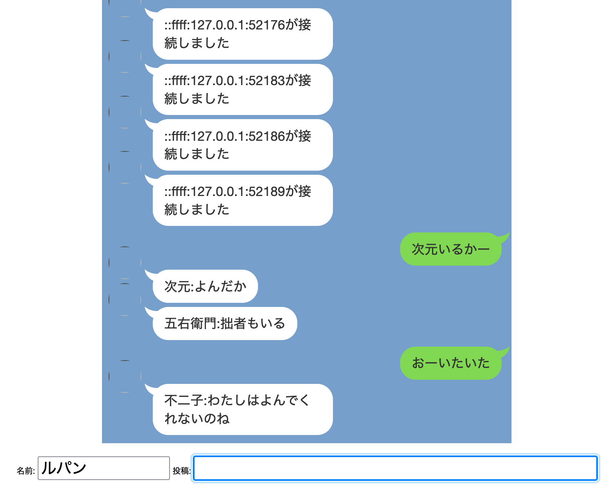
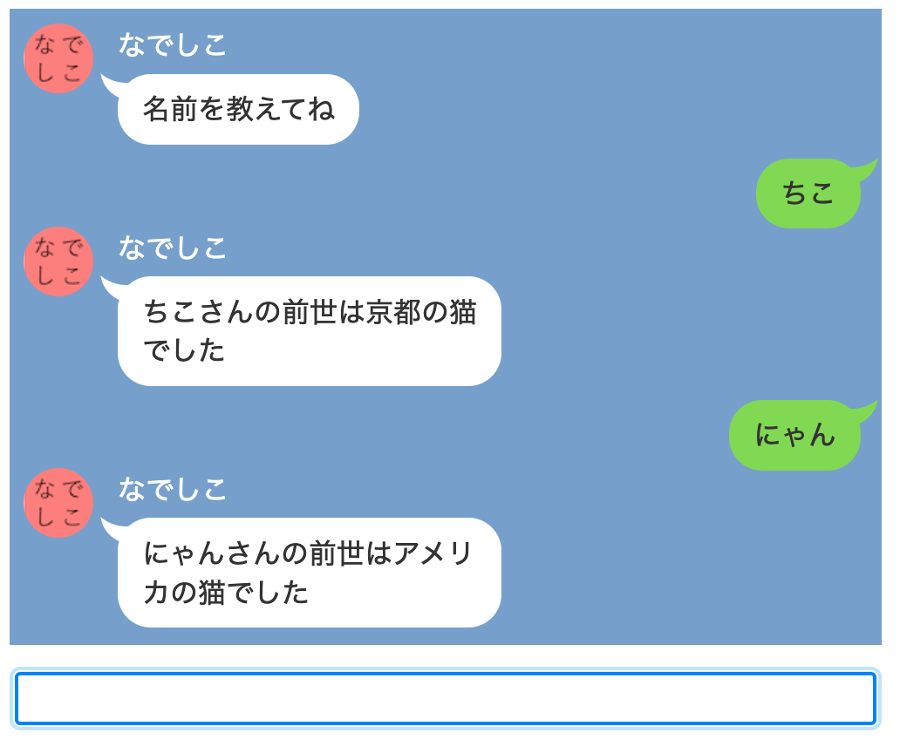
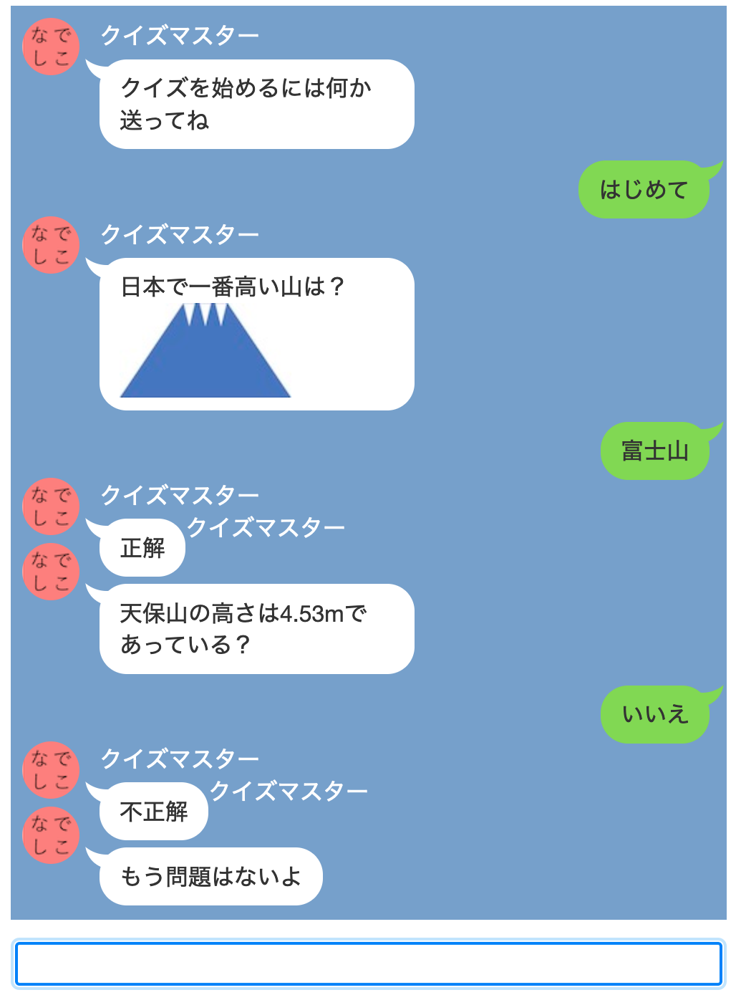

# なでしこで作るwebサービス
## 概要
LINE のような見た目で対話的なサービスを作るサンプルプログラムです。プログラミング言語は[なでしこ](https://nadesi.com/top/)を使っています。
自動応答(autoanswer.nako3)、チャット(chat.nako3)、診断メーカー(shindan.nako3)、クイズ(quiz.png)の4つのプログラムがあります。

## 動作環境
Windows 10, macOS, Linux でテストしています。

## LICENSE
src 内のプログラムやHTMLファイルなどは自由に使って構いません。fukidashi.css については https://jisuijisan.com/speech-bubble/ で公開されているものを使っています。ドキュメントについては  <a rel="license" href="http://creativecommons.org/licenses/by-sa/4.0/">クリエイティブ・コモンズ 表示 - 継承 4.0 国際 ライセンス</a>とします。
