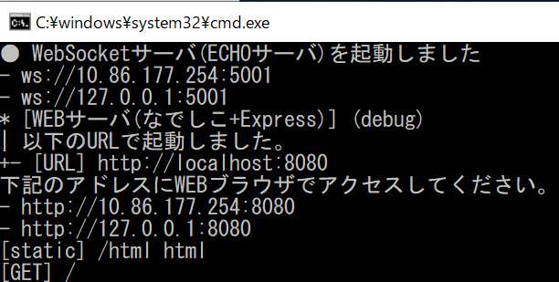
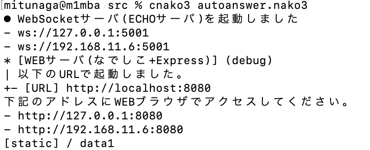
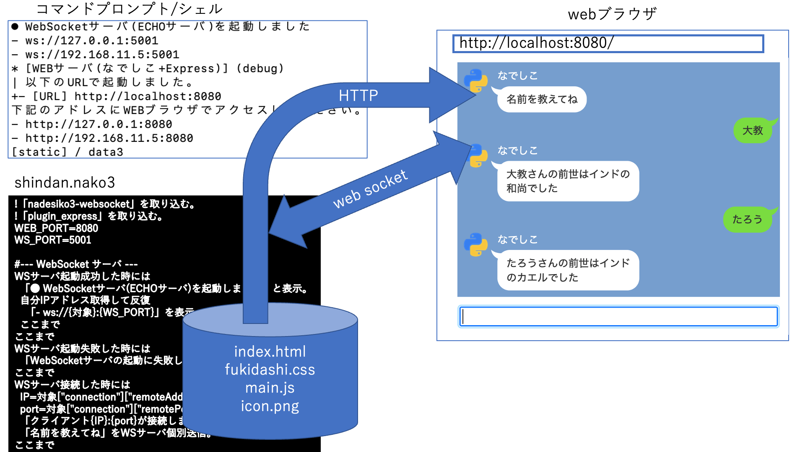
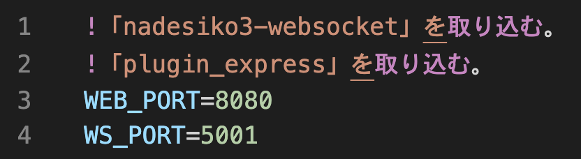
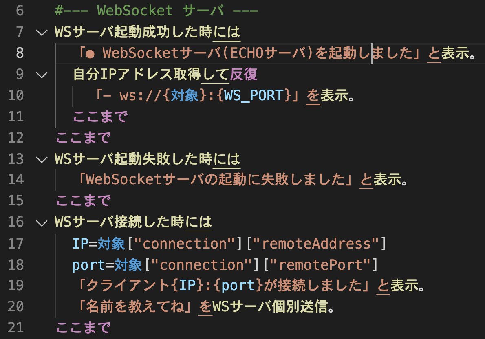
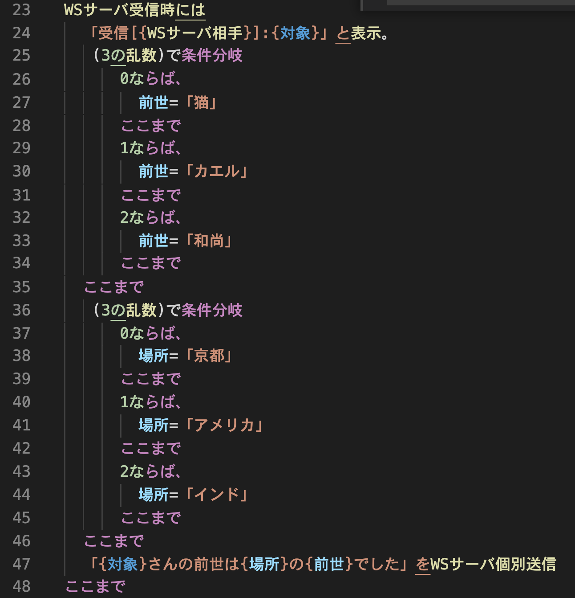
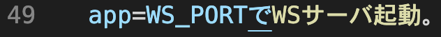
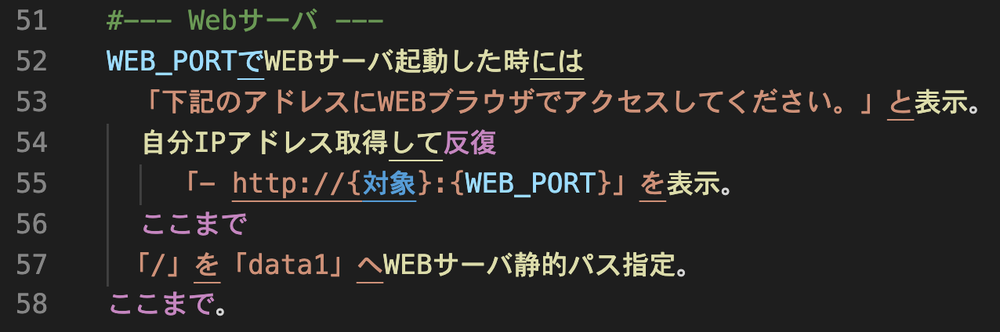

# なでしこで作るwebサービス
## 概要
LINE のような見た目の対話的な web サービスを作るサンプルプログラムです。プログラミング言語は[なでしこ](https://nadesi.com/top/)を使っています。
自動応答(autoanswer.nako3)、チャット(chat.nako3)、診断メーカー(shindan.nako3)、クイズ(quiz.png)の4つのプログラムがあります。


## 動作環境
Windows 10, macOS, Linux でテストしています。[コンソール版のなでしこ v3](https://nadesi.com/doc3/index.php?OS%E5%88%A5) で動作します。

### 実行に必要なプラグイン
実行には nadesiko3-websocket プラグインが必要です。プラグインのインストールは次のようにします。

#### Windows の場合
1. npm-install.vbs をダブルクリックして起動し、nadesiko3-webscoket をインストールします。
1. node_modules 内に fs-extra フォルダを作成します。
1. npm-update.vbs をダブルクリックして起動し、アップデートを実行します。

#### Linux / MacOS の場合
##### (1) ローカルにインストールする場合
プログラムのあるディレクトリ (src) で
```
npm install nadesiko3-websocket
```
を実行します。node_modules, package-lock.json,  package.json ができます。

##### (2) グローバルにインストールする場合
```
npm -g install nadesiko3-websocket
export NODE_PATH=/opt/homebrew/lib/node_modules 
```
を実行します。以下を .zprofile に追加する (zsh を使っている場合) と便利です。
```
export NODE_PATH=/opt/homebrew/lib/node_modules 
```

## 実行方法
### Windows の場合
なでしこv3の開発用エディタ nakopad.vbs を起動して、nako3 ファイルを開いて下さい。nako3 ファイルをダブルクリックでエディタを開くとうまく動かないようです。開いたら実行します。実行の時に Windows Defender の警告が出る場合があります。その場合は、プライベートネットワーク、パブリックネットワークでの通信を許可します。

サーバを起動したらブラウザからアクセスしてみましょう。
http://localhost:8080/ もしくは http://127.0.0.1:8080/ を開いて下さい。cmd.exe の表示にサーバが接続を受け付ける IP アドレスを表示するので、それを使えば同一ネットワークの他のPCやスマートフォンなどからアクセスできます。chat.nako3 はチャットサーバなので、ブラウザで2つウィンドウまたはタブを開くか、別のスマートフォン/PCなどを使って同時にアクセスしてみて下さい。 



プログラムの終了は実行画面(背景が黒いウインドウ)で、Ctrl キーを押しながら Cのキーを押す(Ctrl-C) と「バッチ ジョブを終了しますか (Y/N)?」と聞かれるので y を入れ、エンターキーを押します。 

### Linux / MacOS の場合
シェル（ターミナル）から cnako3 を使って nako3 ファイルを実行して下さい。サーバを起動したらブラウザからアクセスしてみましょう。URL などは Windows の場合と同じです。プログラムを止めるときは Ctrl-C で止めて下さい。



## 動作の説明
### 動作の概要
 診断メーカーで構成を説明します。なでしこで書いたプログラムは shindan.nako3 です。ほかに data1 フォルダ内の fukidashi.css, icon.png, index.html, main.js で構成しています。index.html にブラウザに表示する基本的な部分を書いてあります。またファイルの先頭で、ブラウザに表示する名前を入れている変数に名前「なでしこ」が入っています。icon.png は、診断メーカーのアイコンになっているファイルです。この二つを変えると名前とアイコンが変わります。



fukidashi.css は、表示を吹き出し風にするために使っています。CSS (Cascading Style Sheets, カスケーディングスタイルシート)は HTML の見え方を指定する言語で、fukidashi.css は CSS 言語で書かれたファイルです。HTML だけだと表示がそっけなくなるのを吹き出し風にしています。このファイルのオリジナルは、セイさんによるものhttps://jisuijisan.com/speech-bubble/です。

main.js が web ソケットの通信と、新しい情報の表示を担っています。

fukidashi.css, icon.png, index.html, main.js はブラウザに必要なファイルです。ブラウザでサーバに / を要求すると、サーバは index.html を返します。index.html 内に fukidashi.css と main.js が必要であると書いてあるので、ブラウザはこの2つも要求します。この2つをブラウザが受け取ると表示をきれいにし、 main.js を実行します。main.js は動作の開始時に web socket プロトコルでサーバとの通信を開始します。また main.js は必要に応じて icon.png をサーバに要求します。

ブラウザに文字（名前）を入力してエンターキーを押すと、main.js 内のプログラムが、ブラウザに名前を表示して、サーバに名前を送ります(web socket)。名前を受け取ったサーバ (shindan.nako3) のプログラムは診断結果をブラウザの main.js 内のプログラムに返し(web socket)、受け取ったプログラムがブラウザに表示します。このように、最初の通信は HTTP で、以降の通信は web socket で行います。

### shindan.nako3 の解説


 プログラムの先頭では必要なプラグインを読み込み、HTTP サーバと web socket サーバのポート番号を変数に代入しています。 HTTP サーバのポート番号は 8080 にしています。



 web socket での通信では、サーバの起動、通信の接続、データの受け取りと行ったイベントで何をするかを先に設定してからサーバを起動します。

そこで web socket サーバが起動したとき、起動に失敗したとき、サーバにクライアントが接続したときに実行する内容を書いています。それぞれのイベントが起きたときに「ここまで」のプログラムが実行されます。9, 10 行目では web socket サーバにアクセスするための URL (URI) を表示しています。17〜19行目は、クライアントの情報をコンソールに表示しています。20行目で、クライアントに「名前を教えてね」と返しています。「WSサーバ接続したときには」で「WSサーバ個別送信」を使うと、そのときに接続したクライアントにデータを送信できます。 



 web socket からデータを受け取ったときには「WSサーバ受信時には」から「ここまで」のプログラムが実行されます。このとき「WSサーバ相手」にはクライアントのIPアドレスとポート番号が入っています。「対象」には受け取ったデータ（診断メーカーでは名前）が入っています。

このプログラムは診断メーカーなので、3の乱数(0から2の乱数)で条件分岐をして、前世、場所を決めて、診断結果である文に、対象、場所、前世を埋め込んで、「WSサーバ個別送信」でクライアントにデータ（診断結果）を送信しています。 



この行で web socket のサーバを起動します。 



webサーバを起動し、起動時のメッセージの表示（下記の〜ください。）とサーバのIPアドレスの表示をしています。一つのパソコンに複数のIPアドレスが割り当てられるので、「反復」を使ってすべて表示しています。127.0.0.1 は必ず表示される、パソコン自体を表す IP アドレスです。このアドレスで、ほかのコンピュータと通信は出来ません。それ以外に表示される IP アドレスが他のパソコン等からアクセスできるIPアドレスです。

「WEBサーバ静的パス指定」では、サーバにアクセスしたときにクライアントへ返すデータの入ったディレクトリ（フォルダ）を指定しています。ここでは data1 ディレクトリ(フォルダ）です

### autoanser.nako3 と quiz.nako3
クイズ(quiz.nako3) では画像が入っています。また自動応答 (autoanswer.nako3)ではリンクが入っています。この仕組みは簡単で、なでしこのプログラムから「WSサーバ個別送信」で送っているデータに HTML のタグを使っています。ブラウザはタグを受け取るとimgタグであれば画像をサーバに要求して表示し、リンクであればリンクの表示をします。どのようにしているかは、quiz.nako3, autoanswer.nako3 をみてください。また画像については、data3フォルダの中に画像ファイルがあるのがわかると思います。

クイズについては、通信しているクライアントごとに、どの問題を出したか憶えておく必要があります。そのために、状態という名前の[辞書型変数](https://nadesi.com/v3/doc/index.php?%E3%83%81%E3%83%A5%E3%83%BC%E3%83%88%E3%83%AA%E3%82%A2%E3%83%AB%2F%E8%BE%9E%E6%9B%B8%E5%9E%8B%E5%A4%89%E6%95%B0&show)を使って、クライアントのIPアドレスとポート番号の組みに対して、どの問題を出したか憶えています。 

### chat.nako3
チャットサーバの場合には、受け取ったデータを個別のクライアントではなく、全てのクライアントに送信することで、一つのクライアントが送ったデータを他のクライアントに渡すようにしています。そのため「WSサーバ個別送信」ではなく、「WSサーバ全送信」を使っています。

また自分の入力した内容を表示しないために、chat.js で、自分が直前に送ったメッセージと同じものを受け取った場合には表示しないようにしています。

###  web サーバについて補足
#### URLとフォルダの関係
HTML ファイルと画像ファイルを data1 フォルダ(shindan.nako3 の場合、それ以外ではWEBサーバ静的パス指定で指定しているフォルダに置き換えて読んで下さい)にコピーしてみましょう。 HTML ファイルが nanika.html なら、http://localhost:8080/nanika.html にアクセスすると nanika.html が見れるはずです。画像ファイルが gazou.png なら、http://localhost:8080/gazou.png を開いてみましょう。表示されるはずです。これらから分かるように、URL の後の部分は、このサーバの場合、data1 フォルダ内のファイル名になっています。 

data1 フォルダの中に、folder1 というフォルダを作り、その中に gazou1.png を置いているなら、http://localhost:8080/folder1/gazou1.png でアクセスできます。「/」が区切り記号でフォルダの中にあるファイル(フォルダ)を表します。folder1内のfolder2内の gazou1.png なら、http://localhost:8080/folder1/folder2/gazou1.png となります。

#### index.html の役割
index.html は特別なファイルで、フォルダ内のファイル名を省略したときにサーバが返すファイルです。URLが短くなるのでよく使われます。試しに自分で作った HTML ファイルの名前を index.html に変えて(もとのファイルは別の名前で残しておくといい)ファイル名を省略して (http://localhost:8080/ で) アクセスしてみましょう。

###  web socket とは
HTTP では、ファイルを一つサーバからブラウザに渡すたびに TCP の接続を終了します。そのため大量のアクセスをされても大丈夫なサーバが実現できるというメリットがある一方で、クライアントの要求にすばやく応えて、応答を返すようなことが難しいという問題がありました。

その解決策として使われているのが web socket です。web socket があるから、Google Document, Spreadsheet, G-mail などブラウザ上で動き、データがサーバにあって頻繁にサーバとブラウザが通信しているにもかかわらず、デスクトップアプリケーションのように動作する、web アプリケーションが実現されています。 

## LICENSE
src 内のプログラムやHTMLファイルなどは自由に使って構いません。fukidashi.css については https://jisuijisan.com/speech-bubble/ で公開されているものを使っています。ドキュメントについては <a rel="license" href="http://creativecommons.org/licenses/by-sa/4.0/"></a> <a rel="license" href="http://creativecommons.org/licenses/by-sa/4.0/">クリエイティブ・コモンズ 表示 - 継承 4.0 国際 ライセンス</a>とします。
